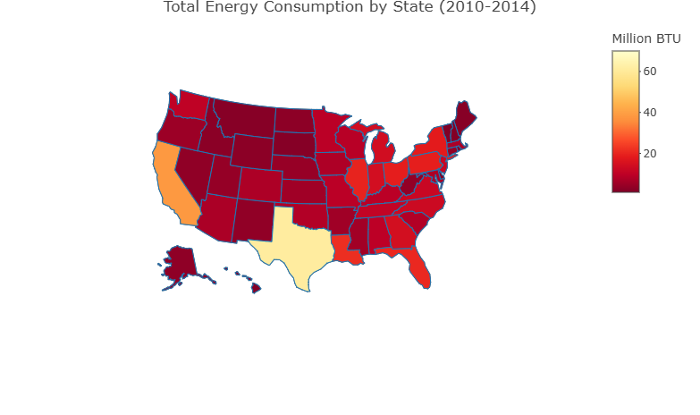

# U.S. Energy & Temperature Analysis

This project analyzes the relationship between **U.S. energy consumption and long-term temperature trends** using data visualization and statistical analysis in **R**.

The goal of the project is to explore whether rising temperatures and regional climate differences are associated with changes in energy demand across U.S. states.

---

# Project Overview

Energy consumption varies significantly across different regions of the United States. At the same time, climate data shows that temperatures have been rising over the past century.

This project investigates:

- How energy consumption differs across U.S. regions and states
- Long-term temperature trends across U.S. states
- Whether warmer states tend to have higher energy demand

Using publicly available datasets, we clean, transform, and visualize the data to identify patterns between **climate and energy usage**.

---

# Technologies Used

- **R**
- **tidyverse**
- **ggplot2**
- **plotly**
- **tidyr**
- **Quarto**

---

# Data Sources

This project uses two publicly available datasets.

## U.S. Energy Consumption Data

**United States Energy, Census, and GDP Dataset (2010–2014)**

Source:  
[us_energy_census_gdp_10-14](https://www.kaggle.com/datasets/lislejoem/us_energy_census_gdp_10-14/data)

Description:
- Contains annual energy consumption data for every U.S. state
- Energy usage measured in **billions of BTU**
- Includes regional and state-level data

## Global Land Temperature Dataset

Source:  
[climate-change-earth-surface-temperature-data](https://www.kaggle.com/datasets/berkeleyearth/climate-change-earth-surface-temperature-data)

Description:
- Historical land surface temperature data from **Berkeley Earth**
- Monthly temperature observations across global locations
- Filtered for **United States state-level data**
- Aggregated into yearly averages for long-term trend analysis

---

# Key Visualizations

The project includes several visualizations to explore the data.

## Regional Energy Consumption

A stacked bar chart comparing total energy consumption across U.S. regions from **2010–2014**.

## State Energy Consumption Map

An interactive **choropleth map** showing total energy consumption by state.

## Temperature Trends Over Time

Interactive time-series visualization showing temperature changes across representative states.

## Long-Term Temperature Comparison

A bar chart comparing the **average long-term temperature** across all U.S. states.

---

# Key Insights

- The **Southern United States consistently consumes the most energy**, while the Northeast consumes the least.
- States such as **Texas, California, Louisiana, and Florida** have the highest overall energy usage.
- Long-term temperature trends show **clear warming patterns across multiple U.S. states**.
- Warmer regions tend to have **higher energy demand**, likely due to increased cooling needs.

---

# Limitations

- The energy dataset only covers **2010–2014**, limiting long-term analysis.
- Energy data is aggregated and does not separate **residential, commercial, or industrial usage**.
- Temperature data contains some missing values in early historical records.

Despite these limitations, the project highlights meaningful relationships between **climate patterns and energy demand**.

---

# Project Report

You can view the full interactive report here:

**Live Report:**  
[link](https://realbogel.github.io/us-energy-temperature-analysis/)

